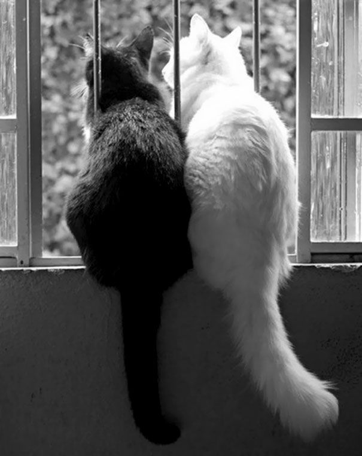
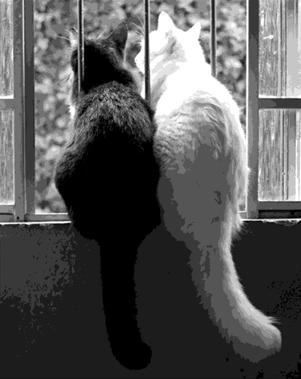

# ImageHalftoning

A MatLab program where you can convert an image into a gray-level printing scheme based on dots patterns.
This application was originally developed in **2017-2018** during a college course.

## What I learnt

* Implementing MatLab functions
* Image/Array manipulation in MatLab
* Image halftoning

## Input vs Output

This is a sample of the final results ...  
* **Original** image:  
  
* **Modified** image: *After scaling down to the original size.*  

